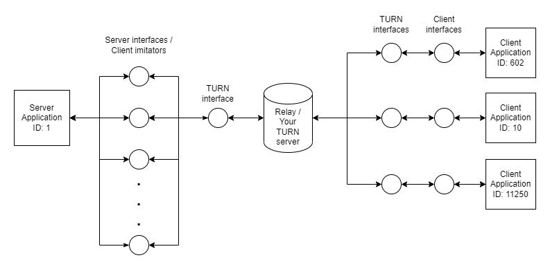

# Your TURN server

Your [TURN](https://www.rfc-editor.org/rfc/rfc5766) (Traversal Using Relays around NAT) server is a minimal,
super flexible TURN server implementation, written in Python.

---
## Features

- **Requires no modifications of the Application**
- **No complicated setups**
- **Fast deployment**
- **Easy to use**
- **Flexible**
- **Minimalism**

This was mainly designed as a prototyping tool for multiplayer games, so performance is not prioritized. Also, it lacks
[STUN](https://www.rfc-editor.org/rfc/rfc5389) functionality.
If you are looking for a faster and more feature complete TURN server,
take a look at [coturn](https://github.com/coturn/coturn) or Rust flavoured [TURN-RS](https://github.com/mycrl/turn-rs).

---
## Description

Main purpose of this tool is to allow easy peer-to-peer (p2p) communication between
a server and multiple clients that can each be (or not) behind multiple NATs - for any application.
Compared to methods such as UPNP config or NAT hole-through punching, this solution should always work.

This is designed to be simple to deploy & use.
It can work just on localhost, LAN or WAN -
basically as long as your ports and IPs are configured correctly, it should work.
It's not recommended using this for large scale, high-throughput, applications because performance consideration aren't
prioritized.

I created this, because I wanted to play the game I'm developing with my friends, and other P2P techniques have failed.
In case anyone is curious, I'm developing and FPS game in [Godot](https://godotengine.org/) - really amazing game
engine - and so far I've been satisfied with the performance.
I have the TURN server running on a RPi 3B+ on Ubuntu 22.04.

---
# How it works

Through the use of a bunch of sockets, practically any application can be relayed over WAN.
Both on Server and the Clients runs a middleware application - Middleman.
Middleman is responsible for delivering the packets to the Relay and making sure those packets reach the
correct destination. Middleman does this by encapsulating received Client Application's packets
and prepending an additional 6 bytes before those packets are forwarded to the Relay.
Those extra bytes contain the information for whom the packet is for.
For Clients, Middleman opens up two sockets.
First one is for communicating with the Application, while the other one with the Relay.
Packet is sent to the first socket, where it is encapsulated.
Then, the Packet is forwarded to the Relay.
When packets are sent to the Relay from Clients, they are always forwarded to the Server.
For Server, a different socket is opened for each of the connecting Clients.
Each socket therefore imitates a connected Client.
Received packet from the Relay is then sent through the appropriate Client imitator socket to the Server.

All of this socket business allows you to use this package with practically any Server-Client type
Application - without any modifications of the Application. However, if you wish to dramatically improve
performance and have access to the source of the Application, and it's transfer protocol, you can integrate the packet
encapsulation directly into it - avoiding the need for the Middleman entirely.

To ensure the connection stays alive, and the router doesn't close it after a few seconds of inactivity, a keep-alive
process runs continuously, and sends ACK packets to connected peers.

While this implementation of a TURN server was inspired by the popular [RFC5766](https://www.rfc-editor.org/rfc/rfc5766)
document, it does not follow the design guide rules fully.

*NOTE: Currently, this only works for UDP streams.*

---
## Setup

Setup is super easy. It's recommended to create a separate virtual environment.

1. Create a virtual environment: `python -m venv env`
2. Install all dependencies: `pip install -r requirements.txt`

The only external library used is [twisted](https://twisted.org/).

---
## Usage

In order for this to work via WAN, you must deploy this package onto a publicly reachable server (from now on, TURN server).
If you are rolling your own server, make sure you forwarded appropriate ports - default is `6969`.

1. Run on TURN server: `python your_turn.py`
2. Run on Server end-point: `python your_turn_middleman.py --server --relay-ip <IP of your TURN server>`
3. Run on Client/s end-point/s: `python your_turn_middleman.py --id 42 --relay-ip <IP of your TURN server>`

The ID is some arbitrary unsigned 32-bit number, but it has to be unique for each Client and greater than 1.
ID of 1 is reserved for the Server.

### Docker

***TODO...***

---
## License

[MIT](LICENSE.md)
